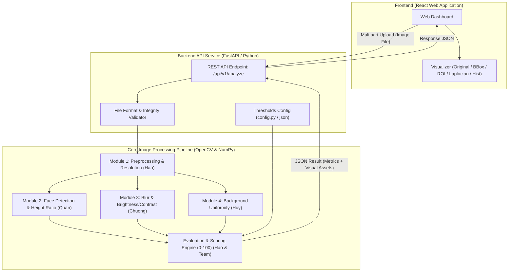

# TÀI LIỆU KIẾN TRÚC HỆ THỐNG VÀ KẾ HOẠCH DỰ ÁN
## ĐỒ ÁN MÔN HỌC: XỬ LÝ ẢNH (DIGITAL IMAGE PROCESSING)
### ĐỀ TÀI: HỆ THỐNG KIỂM TRA VÀ ĐÁNH GIÁ CHẤT LƯỢNG ẢNH THẺ TỰ ĐỘNG (ID PHOTO QUALITY CHECKER)

---

## 1. ĐỊNH HƯỚNG BÁM SÁT MÔN HỌC & NGUYÊN TẮC HỌC THUẬT

### 1.1. Bản chất công nghệ (Không thổi phồng "AI / Deep Learning")
* **Tên hệ thống:** **PhotoCheck** hoặc **ID Photo Quality Checker** (Hệ thống kiểm tra chất lượng ảnh thẻ dựa trên Xử lý ảnh số & Thị giác máy tính - Computer Vision & Digital Image Processing).
* **Phương pháp luận:** **Thuần toán học & thống kê ma trận ảnh (Explainable DIP)** kết hợp rule-based:
  * Không dùng Deep Learning black-box phức tạp cần train model.
  * Mọi tiêu chí đều giải thích tường minh được công thức toán học, ma trận điểm ảnh và không gian màu trước hội đồng bảo vệ.

### 1.2. Chuẩn hóa quy ước kỹ thuật: Preset STANDARD_ID_PHOTO
Nhóm thống nhất một đặc tả kỹ thuật nội bộ cụ thể cho chuẩn ảnh thẻ sinh viên / hồ sơ học tập trong phạm vi đồ án:
* **Định dạng file:** JPG, JPEG, PNG.
* **Tỷ lệ khung hình (Aspect Ratio):** Chuẩn 3:4 (sai số cho phép trong khoảng +- 5%).
* **Độ phân giải tối thiểu (Minimum Resolution):** Quy ước tối thiểu `600 x 800 px` (đảm bảo đủ mật độ điểm ảnh để phân tích nét mặt).
* **Số lượng khuôn mặt (Face Count):** Duy nhất 1 khuôn mặt.
* **Tỷ lệ chiều cao khuôn mặt (Face Height Ratio):**
  * `Face Height Ratio = (Face Bounding Box Height) / (Total Image Height)`
  * *(Khoảng ngưỡng [ratio_min, ratio_max] được xác định chính xác thông qua thực nghiệm trên tập dữ liệu kiểm thử).*
* **Độ sáng & Độ tương phản:** Cường độ trung bình (Mean Intensity) và Độ lệch chuẩn (Std Dev) *(Ngưỡng xác định bằng thực nghiệm)*.
* **Độ rõ nét (Sharpness):** Phương sai toán tử Laplacian `Var(Laplacian)` *(Ngưỡng xác định bằng thực nghiệm)*.
* **Độ đồng nhất nền (Background Uniformity):** Độ lệch chuẩn màu (Std Dev) tại các vùng ROI đại diện (4 góc ảnh / vùng biên) *(Ngưỡng xác định bằng thực nghiệm)*.

---

## 2. NGUYÊN TẮC VÀNG KHI TRIỂN KHAI VÀ BẢO VỆ ĐỒ ÁN 

> **1. Đừng biến Threshold thành "Chân lý" (Data-driven Threshold Tuning)**  
> Mọi con số khởi tạo ban đầu (Laplacian > 80, Brightness 100-200, Face Ratio 0.45-0.65, Background Std < 15) chỉ là **giá trị giả định thô**.  
> Quy trình học thuật chuẩn của nhóm phải tuân thủ nghiêm ngặt:  
> `Dataset Test -> Tính Metric từng ảnh -> Vẽ phân bố (Distribution) -> Thử nghiệm dải Threshold -> Benchmark Ground Truth -> Chốt Threshold tối ưu`  
> **Giá trị bảo vệ:** Khi giảng viên hỏi *"Tại sao chọn ngưỡng 80?"*, nhóm tự tin trả lời: *"Đây là ngưỡng được xác định qua thực nghiệm phân loại trên tập Dataset có gán nhãn Ground Truth, đạt F1-Score cao nhất giữa False Positive và False Negative."*

> **2. Cân đối thời gian: Thuật toán & Thực nghiệm là số 1 (Algorithms > Over-design)**  
> Giao diện Web đẹp chuẩn Enterprise là **vũ khí gây ấn tượng mạnh trong 5 phút demo**, nhưng **xương sống ăn điểm đồ án là Thuật toán + Bảng số liệu thực nghiệm**.  
> * **Lựa chọn đúng:** Web sạch sẽ, trực quan hóa được các bước DIP (Original, Grayscale, Laplacian, ROIs) + Pipeline thực nghiệm có chỉ số khoa học.  
> * Tránh sa đà làm quá nhiều hiệu ứng CSS phức tạp mà lơ là việc tối ưu thuật toán và gán nhãn dataset.

---

## 3. PHÂN TẦNG TÍNH NĂNG (FEATURE MATRIX)

```
+------------------------------------------------------------------------+
| [MUST HAVE] Hoan thanh trong MVP - Cot loi do an                       |
|  - Upload anh (JPG, PNG) & Kiem tra kich thuoc toi thieu, ty le 3:4    |
|  - Tien xu ly (Grayscale, Normalization)                               |
|  - Face Detection: Dem so mat (Face Count = 1)                         |
|  - Face Geometry: Face Height Ratio (H_face / H_img)                   |
|  - Image Quality: Do mo (Laplacian Variance), Do sang (Mean Intensity) |
|  - Background: Phan tich do dong nhat vung ROI 4 goc (Uniformity)      |
|  - Rule Engine: Tinh diem Quality Score (0 - 100) & Ket luan PASS/FAIL |
|  - Web UI: Tai anh, hien thi Bounding Box & Bang ket qua tung tieu chi |
+------------------------------------------------------------------------+
| [SHOULD HAVE] Giai doan 2 - Nang cao tinh hoc thuat & Truc quan        |
|  - Step-by-Step Visualizer (Xem anh Grayscale, ma tran vien, ROIs nen) |
|  - Bieu do phan bo cuong do sang (Brightness Histogram)                |
|  - File cau hinh nguong tap trung (config.json / settings.py)          |
|  - Dataset kiem thu (100-200 anh) co gan Ground Truth chi tiet         |
|  - Bao cao thong ke: Accuracy, Precision, Recall, F1, Confusion Matrix |
+------------------------------------------------------------------------+
| [NICE TO HAVE] Giai doan 3 - Chi lam neu con du thoi gian              |
|  - Tuy chon Preset chi tiet (Anh 3x4 vs 4x6)                           |
|  - Chup anh truc tiep tu Webcam                                        |
|  - Xuat bao cao ket qua PDF                                            |
+------------------------------------------------------------------------+
```

---

## 4. THIẾT KẾ GIAO DIỆN CHUYÊN NGHIỆP (ENTERPRISE UI SPECIFICATION)

### 4.1. Phong cách & Bảng màu
* **Phong cách:** Minimalist Enterprise SaaS (tương tự giao diện Vercel, Linear, Stripe).
* **Màu sắc chủ đạo:**
  * Background: Slate Dark / Off-white sạch sẽ (`#0f172a` hoặc `#f8fafc`).
  * Primary Accent: Deep Blue / Indigo (`#2563eb` / `#4f46e5`).
  * Status PASS: Emerald Green (`#10b981`).
  * Status FAIL: Crimson Red (`#ef4444`).
  * Status WARNING: Amber (`#f59e0b`).

### 4.2. Bố cục màn hình ứng dụng (2 Cột trực quan)
1. **Header Bar:**
   * Logo & Tên hệ thống: **PhotoCheck - ID Photo Quality Checker**.
   * Badge tiêu chuẩn: `Preset: STANDARD_ID_PHOTO (3:4, Min 600x800)`.
2. **Cột trái (Visual Canvas - 55%):**
   * Vùng Drag & Drop upload ảnh thẻ.
   * **Interactive View Selector (Các tab trực quan hóa từng bước xử lý):**
     * `[Ảnh gốc]` | `[Phát hiện mặt & Tỷ lệ]` | `[Vùng 4 góc nền ROI]` | `[Bản đồ viền Laplacian]` | `[Biểu đồ Histogram]`.
     * Cho phép bật/tắt lớp phủ Bounding Box khuôn mặt và các vùng ROI 4 góc nền.
3. **Cột phải (Diagnostics & Evaluation Panel - 45%):**
   * **Thẻ Kết luận (Verdict Banner):** Hiển thị rõ **ĐẠT (PASS)** hoặc **KHÔNG ĐẠT (FAIL)** kèm **Quality Score (0 - 100)**.
   * **Danh sách lý do vi phạm (Failure Reasons):** Nêu rõ nguyên nhân không đạt để người dùng dễ khắc phục.
   * **Bảng kiểm định chi tiết các tiêu chí (Criteria Breakdown):**
     1. Kích thước ảnh: Chiều rộng x Chiều cao & Tỉ lệ khung hình (Min `600 x 800 px`, `3:4`).
     2. Số lượng khuôn mặt: Số mặt phát hiện (Yêu cầu duy nhất = 1).
     3. Tỷ lệ chiều cao khuôn mặt: `H_face / H_img` (So sánh với dải ngưỡng thực nghiệm).
     4. Độ sáng & Độ tương phản: Giá trị cường độ trung bình (Mean Intensity) & Std Dev.
     5. Độ rõ nét: Chỉ số phương sai Laplacian `Var(Laplacian)`.
     6. Độ đồng nhất nền: Độ lệch chuẩn màu vùng biên/4 góc `Std Dev (bg)`.

---

## 5. KIẾN TRÚC HỆ THỐNG & LUỒNG DỮ LIỆU ĐỘC LẬP

### 5.1. Sơ đồ kiến trúc tổng thể



### 5.2. Chuẩn giao tiếp độc lập giữa các Module Xử lý ảnh (Interface Contract)

Mỗi thành viên phát triển module độc lập, nhận vào `image: np.ndarray (BGR)` và trả về `dict` kết quả thống kê:

1. **Quân (`face_analyzer.py`):**
   ```python
   def analyze_face(image: np.ndarray) -> dict:
       # Tra ve dict: face_count, bounding_boxes, face_height_ratio, is_centered
       pass
   ```
2. **Chương (`quality_analyzer.py`):**
   ```python
   def analyze_quality(image: np.ndarray) -> dict:
       # Tra ve dict: brightness_mean, contrast_std, laplacian_var, histogram
       pass
   ```
3. **Huy (`background_analyzer.py`):**
   ```python
   def analyze_background(image: np.ndarray, face_boxes: list) -> dict:
       # Tra ve dict: bg_std_dev, corners_std, is_uniform
       pass
   ```
4. **Hảo (`preprocessor.py` & `evaluator.py`):**
   * Tiền xử lý ảnh gốc:
   ```python
   def preprocess_image(file_bytes: bytes) -> tuple[np.ndarray, dict]:
       # Tra ve: (image_cv2, {"width": int, "height": int, "aspect_ratio_valid": bool, "res_valid": bool})
       pass
   ```
   * Động cơ đánh giá tổng hợp:
   ```python
   def evaluate_results(preproc_res: dict, face_res: dict, quality_res: dict, bg_res: dict, thresholds: dict) -> dict:
       # Tra ve: {"verdict": "PASS"|"FAIL", "score": int, "checks": dict, "reasons": list[str]}
       pass
   ```

### 5.3. Cấu trúc JSON API mẫu trả về Frontend
*(Lưu ý: Các giá trị threshold_min, threshold_max trong JSON bên dưới chỉ là minh họa khởi tạo ban đầu).*

```json
{
  "status": "success",
  "verdict": "FAIL",
  "overall_score": 68,
  "preset": "STANDARD_ID_PHOTO",
  "summary": "Ảnh không đạt do bị mờ và tỷ lệ chiều cao khuôn mặt chưa phù hợp.",
  "bounding_boxes": [
    {
      "x": 120,
      "y": 85,
      "width": 210,
      "height": 260
    }
  ],
  "checks": {
    "image_size": {
      "passed": true,
      "width": 1200,
      "height": 1600,
      "aspect_ratio": "3:4",
      "min_resolution_met": true
    },
    "face_count": {
      "passed": true,
      "detected_count": 1,
      "required": 1
    },
    "face_height_ratio": {
      "passed": false,
      "ratio": 0.35,
      "threshold_min": 0.45,
      "threshold_max": 0.65,
      "message": "Chiều cao khuôn mặt chiếm 35% chiều cao ảnh (Yêu cầu thực nghiệm: 45% - 65%)"
    },
    "brightness": {
      "passed": true,
      "mean_intensity": 142.5,
      "threshold_min": 100,
      "threshold_max": 200
    },
    "sharpness": {
      "passed": false,
      "laplacian_var": 42.1,
      "threshold_min": 80.0,
      "message": "Ảnh bị mờ (Phương sai Laplacian: 42.1 < 80.0)"
    },
    "background_uniformity": {
      "passed": true,
      "std_dev": 8.4,
      "threshold_max_std": 15.0
    }
  },
  "reasons": [
    "Độ rõ nét không đạt (ảnh có dấu hiệu nhòe/mờ nét)",
    "Khuôn mặt đứng quá xa, tỷ lệ chiều cao khuôn mặt nhỏ hơn tiêu chuẩn"
  ],
  "intermediate_visuals": {
    "has_grayscale": true,
    "has_laplacian_map": true,
    "has_background_rois": true,
    "histogram_data": [10, 25, 80, 200, 450, 800, 350, 90]
  }
}
```

---

## 6. PHÂN CHIA NHIỆM VỤ CÂN BẰNG GIỮA 4 THÀNH VIÊN

> **Nguyên tắc phân công:**
> * Cả 4 thành viên đều trực tiếp nắm và code **1 Module Xử lý ảnh lõi (Digital Image Processing Core)** độc lập, có giá trị học thuật ngang nhau khi báo cáo.
> * **Hảo** đóng vai trò Leader và làm Frontend + Pipeline Integration, nhưng được chia sẻ tải: **Quân** phụ trách tích hợp endpoint Face API, **Chương** hỗ trợ cơ chế nạp Threshold tập trung, **Huy** quản lý toàn bộ Benchmark & Dataset Ground Truth.

---

### BẢNG PHÂN CÔNG VAI TRÒ & SẢN PHẨM BÀN GIAO

| Thành viên | Trọng tâm Xử lý ảnh (Core DIP) | Trách nhiệm tích hợp & Hỗ trợ | Sản phẩm bàn giao cụ thể |
| :--- | :--- | :--- | :--- |
| **HẢO** *(Team Leader)* | **Module 1: Preprocessing & Resolution Analysis + Evaluation & Scoring Engine**<br>- Chuẩn hóa ảnh, kích thước, aspect ratio, ma trận Grayscale.<br>- Xây dựng công thức tính điểm (Quality Score 0-100) & Rule-based decision logic. | **Kiến trúc Web Dashboard & Pipeline Tổng**<br>- Thiết kế Web Dashboard (React) chuyên nghiệp.<br>- Xây dựng FastAPI Service chính kết nối toàn bộ pipeline.<br>- Trực quan hóa Step-by-Step Canvas trên Web. | - File `preprocessor.py`<br>- File `evaluator.py`<br>- Mã nguồn Frontend Web (React) & `main.py` FastAPI. |
| **QUÂN** | **Module 2: Face Detection & Face Height Ratio**<br>- Phát hiện khuôn mặt (Haar Cascade / OpenCV DNN).<br>- Thuật toán đếm số khuôn mặt (duy nhất 1).<br>- Tính toán **Face Height Ratio** (`H_face / H_img`) và độ cân đối vị trí tâm mặt. | **Hỗ trợ Integration Face API**<br>- Viết API wrapper cho module Face Detection để Hảo ghép nối nhanh vào FastAPI.<br>- Thử nghiệm chọn lọc mô hình và tối ưu tốc độ nhận diện. | - File `face_analyzer.py`<br>- Script test độc lập cho face detection & bounding box. |
| **CHƯƠNG** | **Module 3: Image Quality (Blur & Brightness/Contrast)**<br>- Thuật toán phát hiện ảnh mờ (Variance of Laplacian).<br>- Phân tích phân bố Histogram cường độ sáng (Mean Intensity, Over/Under-exposure, Contrast Std Dev). | **Hỗ trợ Threshold Management**<br>- Xây dựng module quản lý ngưỡng tập trung (`config.py` / `thresholds.json`).<br>- Thử nghiệm tìm dải ngưỡng mờ và ngưỡng sáng tối ưu. | - File `quality_analyzer.py`<br>- File `config.py` quản lý dải ngưỡng thử nghiệm. |
| **HUY** | **Module 4: Background Uniformity Analysis**<br>- Thuật toán trích xuất các vùng ROI nền đại diện (4 góc ảnh / vùng biên ngoài khuôn mặt).<br>- Tính toán độ lệch chuẩn màu/cường độ (`Std Dev`) đánh giá độ đồng nhất nền. | **Dataset Ground Truth & Benchmarking**<br>- Xây dựng tập Dataset kiểm thử (100-200 ảnh) có gán Ground Truth chi tiết.<br>- Viết script benchmark tự động tính toán Accuracy, Precision, Recall, F1, Confusion Matrix. | - File `background_analyzer.py`<br>- Bộ Dataset kiểm thử kèm file `benchmark_eval.py` xuất bảng số liệu. |

---

## 7. QUY TRÌNH ĐÁNH GIÁ THỰC NGHIỆM VỚI GROUND TRUTH (BENCHMARKING)

Để đảm bảo tính khoa học tuyệt đối trong báo cáo môn học, **Huy** sẽ quản lý tập Dataset theo bảng nhãn Ground Truth tường minh:

### 7.1. Cấu trúc tập Dataset kiểm thử mẫu (`dataset_annotations.json` / CSV)

| Image Name | Ground Truth Verdict | Ground Truth Flaws (Lỗi thực tế) | Expected Outcome |
| :--- | :--- | :--- | :--- |
| `img_001.jpg` | **PASS** | None (Ảnh chuẩn) | PASS |
| `img_002.jpg` | **FAIL** | `FAIL_BLUR` (Ảnh nhòe chuyển động) | Sharpness check FAIL |
| `img_003.jpg` | **FAIL** | `FAIL_DARK` (Thiếu sáng nghiêm trọng) | Brightness check FAIL |
| `img_004.jpg` | **FAIL** | `FAIL_FACE_COUNT` (Ảnh chụp 2 người) | Face count = 2 -> FAIL |
| `img_005.jpg` | **FAIL** | `FAIL_FACE_SIZE` (Đứng quá xa, mặt nhỏ) | Face Height Ratio < min -> FAIL |
| `img_006.jpg` | **FAIL** | `FAIL_BACKGROUND` (Nền có hoa văn/vật thể) | Background Uniformity FAIL |

### 7.2. Pipeline đánh giá độ chính xác (Confusion Matrix)

```
[Ground Truth] ---> (PhotoCheck Pipeline) ---> [So sanh ket qua]
                                                      |
                   +----------------------------------+----------------------------------+
                   |                                                                     |
       [TP: True Positive]                                               [TN: True Negative]
       [FP: False Positive]                                              [FN: False Negative]
                   |                                                                     |
                   +----------------------------------+----------------------------------+
                                                      |
                                                      v
                                      [Accuracy / Precision / Recall / F1]
```

---

## 8. KẾ HOẠCH TIẾN ĐỘ THỰC HIỆN CHI TIẾT (TIMELINE 60 NGÀY)

### GIAI ĐOẠN 1: KHỞI TẠO, ĐẶC TẢ & CHUẨN HÓA GIAO TIẾP (NGÀY 1 - NGÀY 10)
* **Ngày 1 - 3 (Cả nhóm):** Họp thống nhất chuẩn ảnh thẻ `STANDARD_ID_PHOTO` (3:4, Min 600x800), tạo Repository Git, thống nhất chuẩn hàm Python (`input: np.ndarray image -> output: dict metrics`) và JSON Contract.
* **Ngày 4 - 7:**
  * **Hảo:** Khởi tạo dự án React Web + thiết kế layout 2 cột (Khu vực xem ảnh và bảng tiêu chí).
  * **Quân:** Viết script thử nghiệm Face Detection (Haar Cascade & OpenCV DNN) trên 15 ảnh mẫu.
  * **Chương:** Viết script tính Variance of Laplacian và vẽ biểu đồ Histogram trên Jupyter Notebook / Python.
  * **Huy:** Viết script cắt 4 góc ảnh (Corner ROIs) tính độ lệch chuẩn màu trên 15 ảnh nền mẫu.
* **Ngày 8 - 10 (Cả nhóm):** Review code sprint 1, đóng băng giao diện hàm (interface) của 4 module.

---

### GIAI ĐOẠN 2: PHÁT TRIỂN 4 MODULE XỬ LÝ ẢNH ĐỘC LẬP (NGÀY 11 - NGÀY 25)
* **Ngày 11 - 17:**
  * **Hảo:** Hoàn thiện `preprocessor.py` (kiểm tra định dạng, chiều rộng, chiều cao, tỉ lệ khung hình 3:4, resize chuẩn hóa).
  * **Quân:** Hoàn thiện `face_analyzer.py` (phát hiện mặt, trả về bounding box `[x, y, w, h]`, đếm số mặt, tính tỷ lệ `H_face / H_img`).
  * **Chương:** Hoàn thiện `quality_analyzer.py` (tính phương sai Laplacian, cường độ sáng trung bình, độ tương phản) & tạo `config.py`.
  * **Huy:** Hoàn thiện `background_analyzer.py` (tính độ lệch chuẩn màu 4 góc ROI, đánh giá độ đồng nhất nền).
* **Ngày 18 - 25:**
  * **Huy:** Thu thập & gán Ground Truth cho bộ Dataset kiểm thử ban đầu (khoảng 80-100 ảnh mẫu: chuẩn, mờ, tối, nhiều mặt, nền tạp).
  * **Quân & Chương:** Chạy kiểm thử độc lập trên dataset ban đầu để tìm khoảng ngưỡng thô cho Face Ratio, Laplacian Var và Brightness.
  * **Hảo & Quân:** Dựng FastAPI Backend nhận file ảnh, chuẩn bị sẵn endpoint tích hợp.

---

### GIAI ĐOẠN 3: TÍCH HỢP HỆ THỐNG & ĐỘNG CƠ ĐÁNH GIÁ (NGÀY 26 - NGÀY 40)
* **Ngày 26 - 32:**
  * **Hảo:** Phát triển `evaluator.py` (Rule Engine + Thang điểm 100 + Tạo danh sách lý do và lời khuyên).
  * **Hảo & Cả nhóm:** Tích hợp 4 module thành **Image Processing Pipeline** hoàn chỉnh trong Backend API FastAPI.
  * **Hảo:** Kết nối Frontend React với Backend API: Upload ảnh thật -> Nhận JSON -> Render kết quả và vẽ Bounding Box lên Canvas.
* **Ngày 33 - 40:**
  * **Cả nhóm:** Kiểm thử end-to-end toàn bộ luồng trên Web. Tối ưu thời gian xử lý ở mức phù hợp với ứng dụng demo.
  * **Huy:** Mở rộng tập Dataset kiểm thử lên 150-200 ảnh và hoàn thiện gán nhãn Ground Truth (PASS/FAIL và lỗi chi tiết).

---

### GIAI ĐOẠN 4: THỰC NGHIỆM ĐÁNH GIÁ & VISUALIZATION (NGÀY 41 - NGÀY 52)
* **Ngày 41 - 46:**
  * **Huy:** Chạy script `benchmark_eval.py` tự động trên toàn bộ dataset kiểm thử có Ground Truth, xuất bảng chỉ số thống kê: **Accuracy, Precision, Recall, F1-Score, Ma trận nhầm lẫn (Confusion Matrix)** cho từng tiêu chí.
  * **Quân, Chương, Huy:** Dựa trên kết quả thực nghiệm để tinh chỉnh lại file cấu hình ngưỡng (`config.py` / `thresholds.json`) đạt độ chính xác tối ưu.
  * **Hảo:** Bổ sung tính năng **Visual Step-by-Step** trên Web (Tab xem ảnh Grayscale, ma trận viền Laplacian, vùng ROI nền 4 góc và biểu đồ Histogram).
* **Ngày 47 - 52:**
  * **Cả nhóm:** Kiểm thử đóng gói toàn diện hệ thống, sửa các lỗi giao diện và góc cạnh thuật toán.

---

### GIAI ĐOẠN 5: VIẾT BÁO CÁO, SLIDE & TỔNG DUYỆT DEMO (NGÀY 53 - NGÀY 60)
* **Ngày 53 - 56 (Phân chia viết báo cáo môn học):**
  * **Hảo:** Viết Chương 1 (Giới thiệu bài toán, mục tiêu), Chương 2 (Kiến trúc hệ thống, Luồng xử lý Pipeline & Thiết kế Giao diện Web) và Động cơ tính điểm.
  * **Quân:** Viết Chương 3.1: Cơ sở lý thuyết & Thuật toán Face Detection, Face Geometry & Face Height Ratio (kèm công thức toán và hình minh họa).
  * **Chương:** Viết Chương 3.2: Cơ sở lý thuyết & Thuật toán Độ mờ (Laplacian Variance) và Phân tích Histogram độ sáng/độ tương phản.
  * **Huy:** Viết Chương 3.3 (Phân tích độ đồng nhất nền qua ROI) và Chương 4 (Thực nghiệm & Đánh giá kết quả: Bảng số liệu Accuracy, Precision, Recall, Ma trận nhầm lẫn từ Ground Truth).
* **Ngày 57 - 60 (Cả nhóm):**
  * Thiết kế Slide báo cáo đồng bộ, chuyên nghiệp.
  * Chuẩn bị sẵn kịch bản demo (Tập ảnh đại diện: 1 ảnh chuẩn ĐẠT, 1 ảnh mờ nét, 1 ảnh tối, 1 ảnh 2 người, 1 ảnh nền rối).
  * Tổng duyệt thuyết trình thử trước buổi chấm đồ án.
